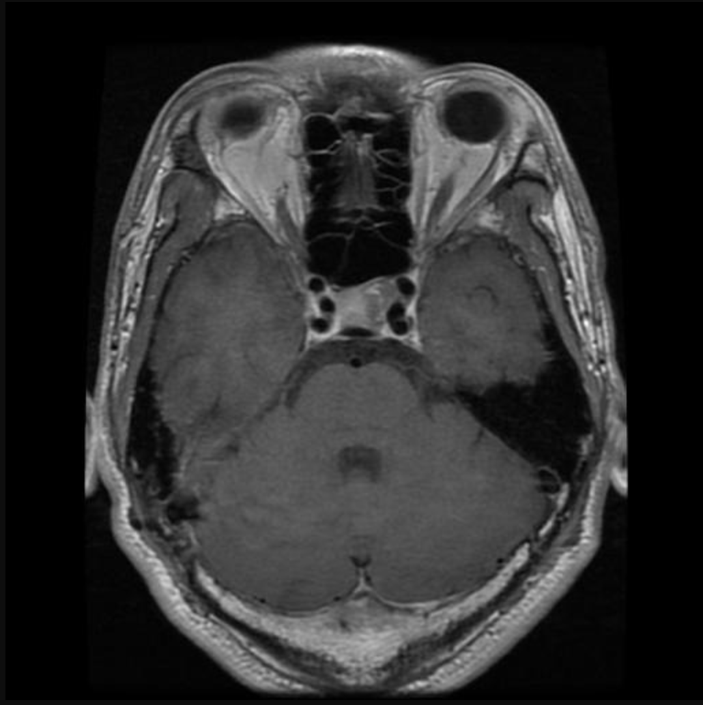
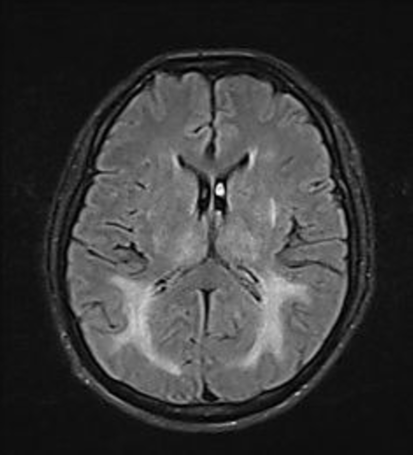

# 🧠 Brain Tumor Classification with Deep Learning

An AI-powered web application that classifies brain MRI scans into four categories: **Glioma**, **Meningioma**, **Pituitary Tumor**, and **No Tumor**. Features explainable AI with saliency maps and AI-generated explanations.

---

## 🚀 **[Try the Live Demo Now!](https://brain-mri-classification-2024.streamlit.app/)**

**Click above to test the app with your own MRI images or use our sample images - no installation required!**

[](https://brain-mri-classification-2024.streamlit.app/)

---

## 📺 Project Overview Video

[](https://www.youtube.com/watch?v=QWGz6a7xQn0)

---

## ✨ Key Features

- **🎯 Multi-Class Classification**: Identifies 4 types of brain conditions from MRI scans
- **🤖 Dual Model Architecture**: Choose between Custom CNN or Transfer Learning (Xception)
- **🔍 Explainable AI**: Saliency maps highlight regions the model focuses on
- **💬 AI-Powered Explanations**: Google Gemini generates natural language explanations
- **📊 Confidence Scores**: View prediction probabilities for all classes
- **🖼️ Sample Images**: Test the app instantly with pre-loaded MRI examples
- **☁️ Cloud Deployed**: 24/7 availability on Streamlit Cloud

---

## 🎨 Example Results

### Pituitary Tumor Detection

<div align="center">

**Input MRI Scan:**



</div>

<div align="center">

**Model Prediction & Analysis:**


</div>

<div align="center">

✅ **Predicted:** Pituitary Tumor | 📈 **Confidence:** 99.98% | 🎯 **Status:** Correct Detection

</div>

---

### No Tumor (Healthy Brain)

<div align="center">

**Input MRI Scan:**



</div>

<div align="center">

**Model Prediction & Analysis:**


</div>

<div align="center">

✅ **Predicted:** No Tumor | 📈 **Confidence:** 99.91% | 🎯 **Status:** Correct Detection

</div>

---

## 🏗️ Architecture

### Model 1: Custom CNN
- 4 Convolutional blocks with MaxPooling and Dropout
- L2 regularization for better generalization
- Input: 224×224×3 RGB images
- Output: 4-class softmax predictions

### Model 2: Transfer Learning (Xception)
- Pre-trained on ImageNet
- Fine-tuned dense layers for brain tumor classification
- Input: 299×299×3 RGB images
- Achieves high accuracy with fewer training epochs

### Key Technologies
- **Framework:** TensorFlow/Keras
- **Frontend:** Streamlit
- **Explainability:** Gradient-based saliency maps
- **AI Integration:** Google Gemini for explanations
- **Deployment:** Streamlit Cloud + Google Drive (model hosting)

---

## 📊 Dataset

**Source:** [Brain Tumor MRI Dataset](https://www.kaggle.com/datasets/masoudnickparvar/brain-tumor-mri-dataset) (Kaggle)

**Classes:**
- Glioma
- Meningioma
- No Tumor
- Pituitary

**Preprocessing:**
- Image rescaling (0-1 normalization)
- Brightness augmentation
- Stratified train/validation/test split

---

## 🚀 Try It Out

### Option 1: Live Demo (Recommended)
👉 **[Launch App](https://brain-mri-classification-2024.streamlit.app/)** - No installation required!

### Option 2: Run Locally

1. **Clone the repository**
   ```bash
   git clone https://github.com/AvidThinkerArsum/Brain-Tumor-Classification.git
   cd Brain-Tumor-Classification
   ```

2. **Install dependencies**
   ```bash
   pip install -r requirements.txt
   ```

3. **Set up Google API key** (optional, for AI explanations)
   ```bash
   echo 'GOOGLE_API_KEY=your_api_key_here' > .env
   ```
   Get your key from: https://aistudio.google.com/app/apikey

4. **Run the app**
   ```bash
   streamlit run app.py
   ```

5. **Open your browser**
   ```
   http://localhost:8501
   ```

---

## 📁 Project Structure

```
Brain-Tumor-Classification/
├── app.py                          # Main Streamlit application
├── models/
│   ├── cnn_model.h5                # Custom CNN model (55MB)
│   └── xception_model.weights.h5   # Xception weights (242MB)
├── sample_data/                    # Sample MRI images for testing
│   ├── Glioma.png
│   ├── Meningioma.png
│   ├── NoTumor.png
│   └── Pituitary.png
├── static/
│   ├── Results/                    # Result screenshots
│   └── saliency_maps/              # Generated saliency visualizations
├── notebooks/
│   └── BrainTumor.ipynb           # Training & experimentation notebook
├── requirements.txt                # Python dependencies
├── .streamlit/
│   ├── config.toml                 # App configuration
│   └── secrets.toml.example        # Secrets template
└── README.md                       # This file
```

---

## 🎯 How It Works

1. **Upload** or select a sample brain MRI scan
2. **Choose** between Custom CNN or Xception model
3. **View** predictions with confidence scores
4. **Analyze** saliency maps showing focus regions
5. **Read** AI-generated explanations of the diagnosis

---

## 🧪 Model Performance

| Model | Accuracy | Precision | Recall |
|-------|----------|-----------|--------|
| Custom CNN | 80-90% | High | High |
| Xception | 97%+ | Very High | Very High |

*Performance varies based on test set and specific tumor types*

---

## 🤝 Contributing

Contributions are welcome! Feel free to:
- Report bugs
- Suggest features
- Submit pull requests

---

## 📝 License

This project is licensed under the MIT License.

---

## 🙏 Acknowledgments

- Dataset: [Masoud Nickparvar](https://www.kaggle.com/datasets/masoudnickparvar/brain-tumor-mri-dataset)
- Framework: TensorFlow/Keras
- Deployment: Streamlit Cloud
- AI Integration: Google Gemini

---

## 📧 Contact

**Arsum Nadeem Chaudhary**
- GitHub: [@AvidThinkerArsum](https://github.com/AvidThinkerArsum)
- Project Link: [https://github.com/AvidThinkerArsum/Brain-Tumor-Classification](https://github.com/AvidThinkerArsum/Brain-Tumor-Classification)
- Live Demo: [https://brain-mri-classification-2024.streamlit.app/](https://brain-mri-classification-2024.streamlit.app/)

---

**⭐ If you found this project useful, please consider giving it a star!**
